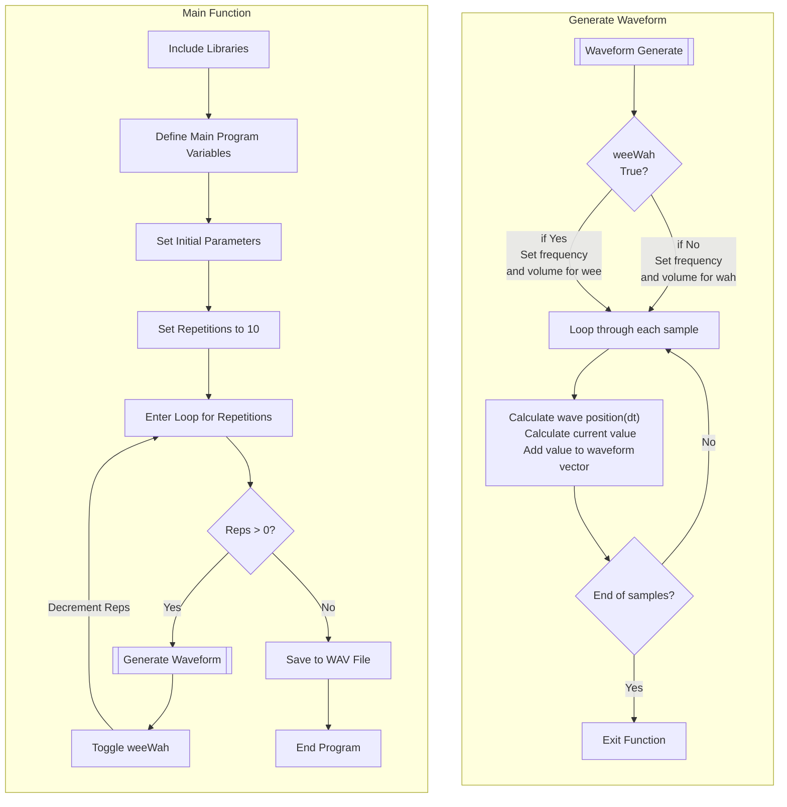

```mermaid
graph
subgraph Generate Waveform
  direction TB
    AA[[Waveform Generate]] --> BB{"weeWah 
    True?"};
    BB -->|"if Yes 
    Set frequency 
    and volume for wee"| FF;
    BB -->|"if No 
    Set frequency 
    and volume for wah"| FF[Loop through each sample];
    FF --> GG["Calculate wave position(dt)
    Calculate current value
    Add value to waveform vector"];
    GG --> JJ{End of samples?};
    JJ -->|No| FF;
    JJ -->|Yes|MM[Exit Function]
    
  end

subgraph Main Function
  direction TB
    B[Include Libraries] --> C[Define Main Program Variables];
    C --> D[Set Initial Parameters];
    D --> E[Set Repetitions to 10];
    E --> F[Enter Loop for Repetitions];
    F --> G{Reps > 0?};
    G -->|Yes| H[[Generate Waveform]];
    G -->|No| I[Save to WAV File];
    H --> J[Toggle weeWah];
    J -->|"Decrement Reps"| F;
    I --> M[End Program];
  end
```
