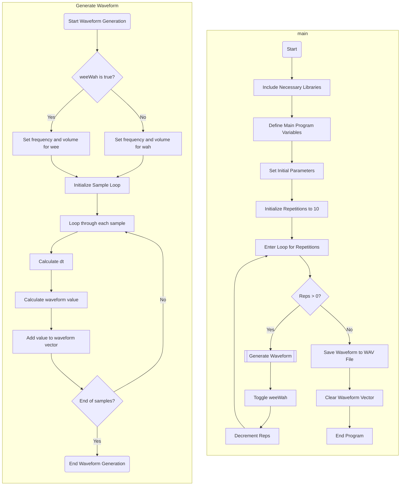

```mermaid
graph
direction LR

subgraph main
  direction TB
  A(Start) --> B[Include Necessary Libraries];
    B --> C[Define Main Program Variables];
    C --> D[Set Initial Parameters];
    D --> E[Initialize Repetitions to 10];
    E --> F[Enter Loop for Repetitions];
    F --> G{Reps > 0?};
    G -->|Yes| H[[Generate Waveform]];
    G -->|No| I[Save Waveform to WAV File];
    H --> J[Toggle weeWah];
    J --> K[Decrement Reps];
    K --> F;
    I --> L[Clear Waveform Vector];
    L --> M[End Program];
  end

subgraph Generate Waveform
  direction TB
    AA(Start Waveform Generation) --> BB{weeWah is true?};
    BB -->|Yes| CC[Set frequency and volume for wee];
    BB -->|No| DD[Set frequency and volume for wah];
    CC --> EE[Initialize Sample Loop];
    DD --> EE;
    EE --> FF[Loop through each sample];
    FF --> GG[Calculate dt];
    GG --> HH[Calculate waveform value];
    HH --> II[Add value to waveform vector];
    II --> JJ{End of samples?};
    JJ -->|Yes| KK(End Waveform Generation);
    JJ -->|No| FF;
  end
```
