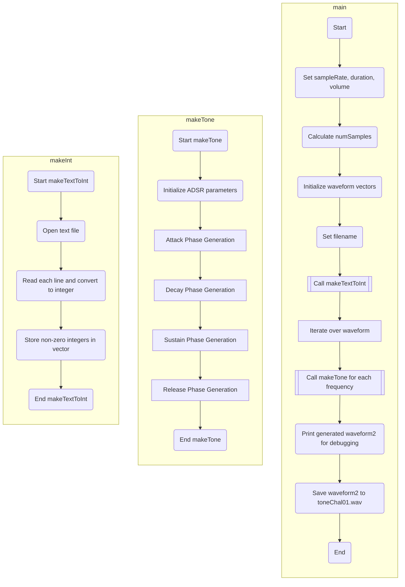

```mermaid
graph
direction LR
subgraph main
  direction TB;
    A(Start) --> B(Set sampleRate, duration, volume)
    B --> C(Calculate numSamples)
    C --> D(Initialize waveform vectors)
    D --> E(Set filename)
    E --> F[[Call makeTextToInt]]
    F --> G[Iterate over waveform]
    G --> H[[Call makeTone for each frequency]]
    H --> I(Print generated waveform2 for debugging)
    I --> J(Save waveform2 to toneChal01.wav)
    J --> K(End)
end
subgraph makeTone
direction TB
    BA(Start makeTone) --> BB(Initialize ADSR parameters)
    BB --> BC[Attack Phase Generation]
    BC --> BD[Decay Phase Generation]
    BD --> BE[Sustain Phase Generation]
    BE --> BF[Release Phase Generation]
    BF --> BG(End makeTone)
end

subgraph makeInt
direction TB
    CA(Start makeTextToInt) --> CB(Open text file)
    CB --> CC(Read each line and convert to integer)
    CC --> CD(Store non-zero integers in vector)
    CD --> CE(End makeTextToInt)
end


```
