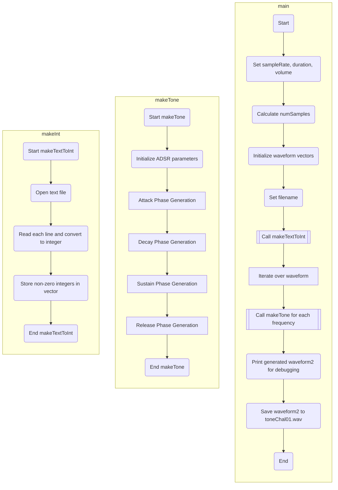

Initialize sample rate, duration, volume, and the number of samples
Initialize three vectors for waveform, modified waveform, and waveform with durations
Set the filename for the input text file

Call makeTextToInt to convert text to integers and store them in waveform
Iterate through the waveform vector:
For each frequency value in the waveform, call makeTone to generate and add ADSR modified samples to waveform2

Print the generated waveform2 for debugging
Save the waveform2 to a WAV file named "toneChal01.wav"
End

Function makeTone(waveform, volume, numSamples, sampleRate, frequency)
Initialize ADSR envelope parameters:
- Attack phase starts at 0 and ends at 30% of numSamples
- Decay phase starts immediately after Attack and ends at 60% of numSamples
- Sustain phase starts immediately after Decay and ends at 80% of numSamples
- Release phase starts immediately after Sustain and ends at 100% of numSamples

For each phase (Attack, Decay, Sustain, Release):
Calculate the volume modifier based on the current phase's properties
Generate waveform samples using the sine function with the volume modifier

End Function

Function makeTextToInt(filename)
Open the text file specified by filename
Initialize an empty vector waveform
Read each line from the file
Convert the line to an integer
If the integer is not 0 and the previous integer is not 0, add it to the waveform vector
Return the waveform vector
End Function

