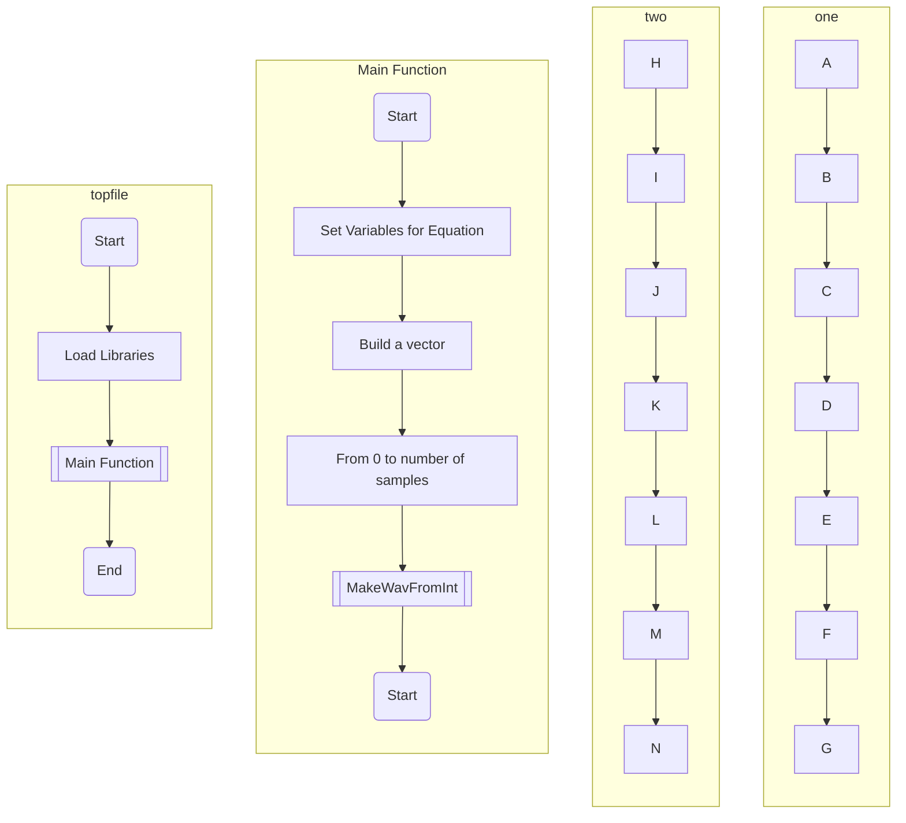

```mermaid

flowchart TB
subgraph one
direction TB
A-->B
B-->C
C-->D
D-->E
E-->F
F-->G
end
subgraph two
direction TB 
H-->I
I-->J
J-->K
K-->L
L-->M
M-->N
end
subgraph Main Function
direction TB 
O(Start)-->P
P[Set Variables for Equation]-->Q
Q[Build a vector]-->R
R[From 0 to number of samples]-->S
S[[MakeWavFromInt]]-->T(Start)
end
subgraph topfile
direction TB 
V(Start)-->W[Load Libraries]
W-->X[[Main Function]]
X-->Y(End)
end
```
