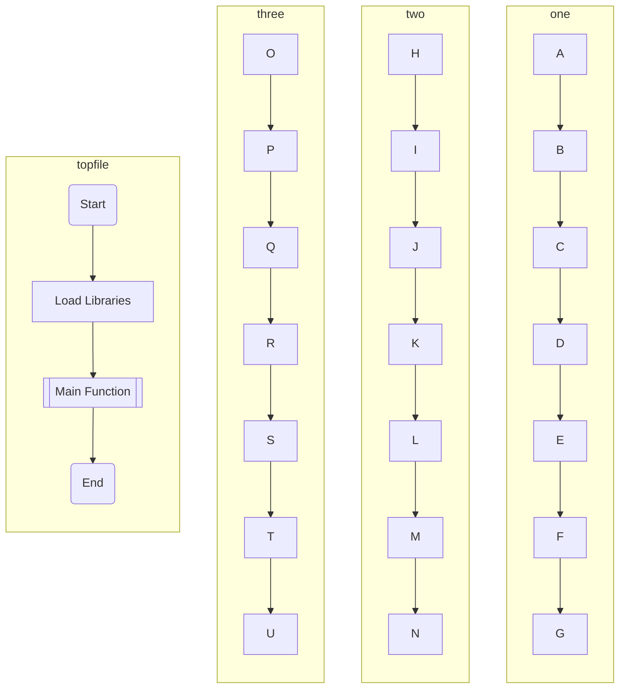

```mermaid

flowchart TB
subgraph one
direction TB
A-->B
B-->C
C-->D
D-->E
E-->F
F-->G
end
subgraph two
direction TB 
H-->I
I-->J
J-->K
K-->L
L-->M
M-->N
end
subgraph three
direction TB 
O-->P
P-->Q
Q-->R
R-->S
S-->T
T-->U
end
subgraph topfile
direction TB 
V(Start)-->W[Load Libraries]
W-->X[[Main Function]]
X-->Y(End)
end
```
