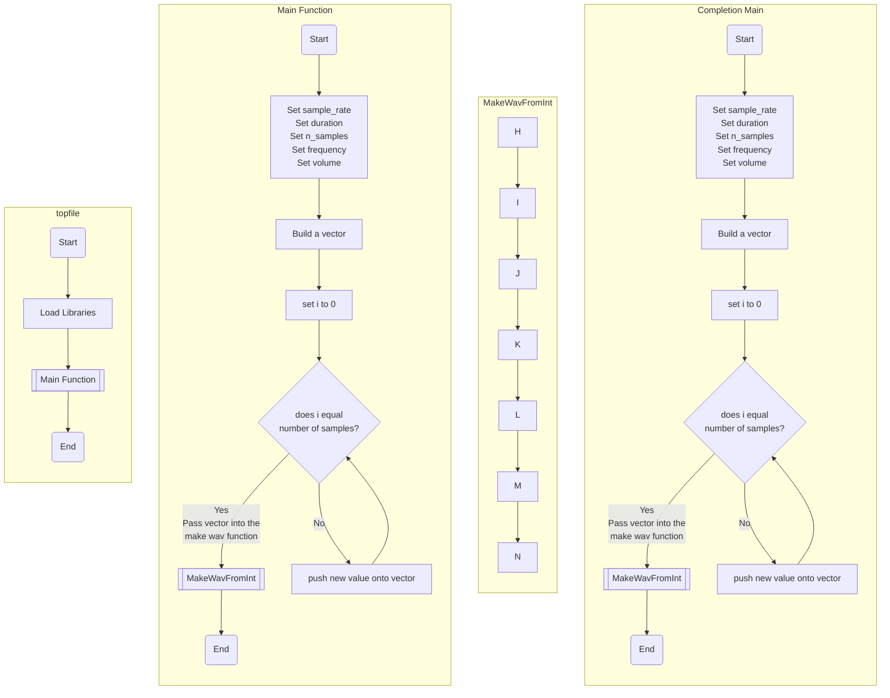

1. Start
2. Include Necessary Libraries
   - Include the input-output library for console operations
   - Include the math library for sine function
   - Include the vector library for using vector data structures
   - Include a custom helper library for WAV file operations ("wav.hpp")
3. Define Main Program Function
   - Set sample rate to 44,100 (standard for CD-quality audio)
   - Set duration to 1 second
   - Initialize repetitions to 10
   - Create an empty vector to store the waveform data
   - Initialize variables for frequency and volume
   - Calculate the number of samples (sample rate * duration)
   - Set initial values for "wee" and "wah" sound parameters (frequency, volume, sample count)
   - Initialize a loop counter for samples and a boolean flag for alternating between "wee" and "wah" sounds
4. Start Looping for Repetitions
   - If the flag is set for "wee" (true), use "wee" parameters; otherwise, use "wah" parameters for frequency and volume
   - Generate waveform data:
     - For each sample in the section:
       a. Calculate the time delta (dt) as the current sample index divided by the total number of samples
       b. Calculate the waveform value for the current sample as volume * sin(2 * π * frequency * dt)
       c. Add this waveform value to the waveform vector
   - Toggle the "wee-wah" flag to alternate sound for the next repetition
   - Decrease the repetitions count
   - Print the current state of the "wee-wah" flag (mostly for debugging purposes)
5. After Looping
   - Save the generated waveform to a file named "toneComp01.wav"
   - Clear the waveform vector to free up memory
6. End Program
   - Return 0 to indicate successful execution
7. End

