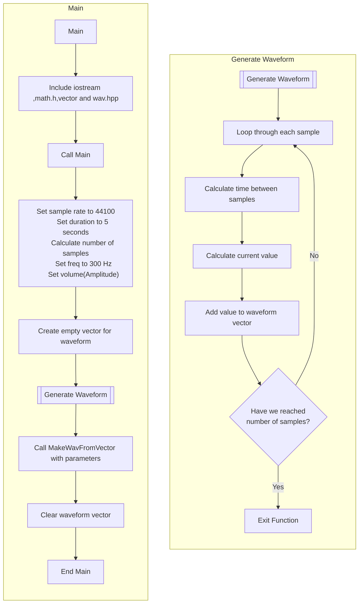

Include Libraries

Define Main
        Set sample rate to 44100
        Set duration to 5 seconds
        Set number of samples to sample rate * duration
        Set freq to 300 Hz
        Set volume(Amplitude)
        Create an empty vector for waveform

Generate Waveform
        for every sample from 0 to number of samples:
            recalculate the position on the wave(dt) as the current sample index divided by the total number of samples.
                then Calculate the waveform value for the current sample as volume multiplied by the sine of 2π times the frequency times dt.
                    then Push this value to the waveform vector
        
When Generate has finished
        Call MakeWavFromVector from the wav.hpp 
            then pass the arguments of filename "toneCore01.wav" ,total number of samples and waveform vector.
        Clear the waveform vector to free up memory.
        Return 0 to indicate successful completion.
