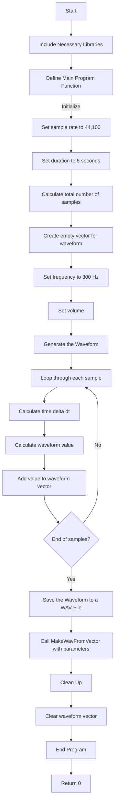

###Include Necessary Libraries
        Include the input-output library for general input and output operations.
        Include the math library for mathematical functions, specifically for the sine function.
        Include the vector library to use vector data structures.
        Include a custom helper library for WAV file operations, identified as "wav.hpp".

###Define Main Program Function
        Initialize the sample rate to 44,100 samples per second (standard for CD-quality audio).
        Set the duration of the tone to 5 seconds.
        Calculate the total number of samples by multiplying the sample rate by the duration.
        Create an empty vector to store the waveform data.
        Set the frequency of the tone to 300 Hz.
        Set the volume of the tone.

###Generate the Waveform
        Loop through each sample from 0 to the total number of samples:
            Calculate the time delta dt as the current sample index divided by the total number of samples.
            Calculate the waveform value for the current sample as the sine of 2π times the frequency times dt, scaled by the volume.
            Add this waveform value to the waveform vector.

###Save the Waveform to a WAV File
        Call a function MakeWavFromVector, passing the filename "toneCore01.wav", the total number of samples, and the waveform vector as arguments. This function presumably saves the waveform data to a WAV file.

###Clean Up
        Clear the waveform vector to free up memory.
###End Program
        Return 0 to indicate successful completion.
